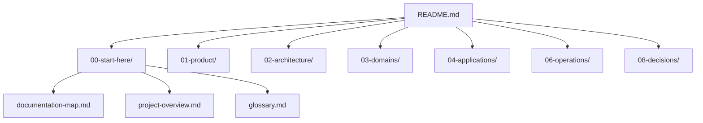

# Bản đồ tài liệu (Documentation Map)

> Hướng dẫn định tuyến đọc tài liệu trong thư mục [docs/](file:///d:/Admin%20Rental/rental-admin-be/docs) cho các thành viên dự án Rental Admin dựa trên vai trò của họ.

---

## 🗺️ Bản đồ phân nhóm tài liệu

Tài liệu được phân chia theo tiêu chuẩn quản lý hệ thống chuyên nghiệp để tách biệt mối quan tâm giữa Nghiệp vụ (Business Domains), Quy chuẩn ứng dụng (Applications/Tech Stack), và Vận hành (Operations).

---

## 🧭 Lộ trình đọc tài liệu theo vai trò

### 1. Backend Developer (NestJS / Prisma)
Nếu bạn là lập trình viên backend hoặc cần tìm hiểu cách cơ sở dữ liệu và API vận hành:
1. **Tổng quan DB**: Đọc [database-schema.md](file:///d:/Admin%20Rental/rental-admin-be/docs/02-architecture/database-schema.md) để nắm cấu trúc bảng PostgreSQL và Prisma.
2. **Redis/cache/lock**: Đọc [redis-usage-plan.md](file:///d:/Admin%20Rental/rental-admin-be/docs/02-architecture/redis-usage-plan.md) để nắm Redis key pattern, cache, rate-limit, distributed lock và realtime event.
3. **Quy chuẩn lập trình**: Đọc [conventions.md](file:///d:/Admin%20Rental/rental-admin-be/docs/04-applications/backend/conventions.md) để biết cách viết Service, Controller, DTO và accent-insensitive search.
4. **Danh sách API**: Tra cứu tại [endpoints.md](file:///d:/Admin%20Rental/rental-admin-be/docs/04-applications/backend/endpoints.md).
5. **Auth session & RBAC cache**: Đọc [auth-session-and-permission-cache.md](file:///d:/Admin%20Rental/rental-admin-be/docs/03-domains/rbac/auth-session-and-permission-cache.md) để hiểu Redis session, refresh token rotation và định hướng cache permission.
6. **Quy tắc Nghiệp vụ**: Đọc [status-flow-rules.md](file:///d:/Admin%20Rental/rental-admin-be/docs/03-domains/rental-orders/status-flow-rules.md) (luồng đơn thuê) và [availability-rules.md](file:///d:/Admin%20Rental/rental-admin-be/docs/03-domains/availability/availability-rules.md) (luật kiểm tra trùng lịch thiết bị).

### 2. Frontend Developer (Next.js App Router)
Nếu bạn chịu trách nhiệm xây dựng giao diện Admin Dashboard và các flow xử lý:
1. **Giao diện & Sitemap**: Đọc mục *Màn hình cần xây dựng* trong [project-overview.md](file:///d:/Admin%20Rental/rental-admin-be/docs/00-start-here/project-overview.md).
2. **Quy chuẩn frontend**: Xem [conventions.md](file:///d:/Admin%20Rental/rental-admin-be/docs/04-applications/frontend/conventions.md) để tuân thủ quy tắc viết Schema Zod, Hook form, API Service và Toast message tiếng Việt.
3. **Vòng đời đơn hàng**: Hiểu cách chuyển trạng thái tại [status-flow-rules.md](file:///d:/Admin%20Rental/rental-admin-be/docs/03-domains/rental-orders/status-flow-rules.md).

### 3. QA / QC / Tester
Nếu bạn là kiểm thử viên hoặc cần viết kịch bản test:
1. **Yêu cầu nghiệp vụ**: Đọc [business-requirements.md](file:///d:/Admin%20Rental/rental-admin-be/docs/01-product/business-requirements.md) để hiểu rõ phạm vi Phase 1 (không có checkout tự phục vụ, không có online payment gateway).
2. **Quy tắc phân quyền**: Đọc [rbac-rules.md](file:///d:/Admin%20Rental/rental-admin-be/docs/03-domains/rbac/rbac-rules.md) để kiểm tra phân quyền cho Admin, Manager, Staff, và Viewer.
3. **Luật đơn thuê**: Kiểm tra các bước chuyển đổi trạng thái và luật cọc/phí tại [status-flow-rules.md](file:///d:/Admin%20Rental/rental-admin-be/docs/03-domains/rental-orders/status-flow-rules.md).

### 4. DevOps / Vận hành hệ thống
Nếu bạn cần triển khai hệ thống lên môi trường hoặc thiết lập database ban đầu:
1. **Thiết lập database & seed dữ liệu**: Đọc hướng dẫn chạy seed tại [seeding.md](file:///d:/Admin%20Rental/rental-admin-be/docs/06-operations/seeding.md).
2. **Lệnh phát triển**: Tham khảo [dev-commands.md](file:///d:/Admin%20Rental/rental-admin-be/docs/06-operations/dev-commands.md).
