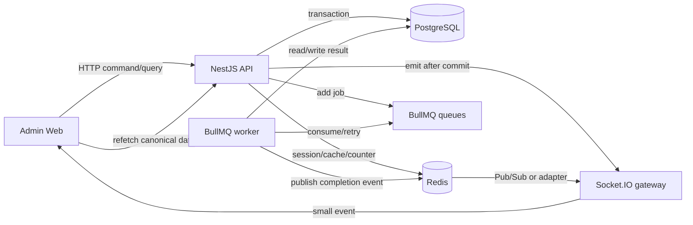
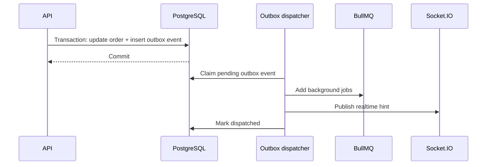

# Thiết kế Redis, BullMQ và Socket.IO theo tính năng

> Tài liệu này là nguồn tham chiếu chính để quyết định khi nào dùng Redis, BullMQ hoặc Socket.IO trong Rental Admin Backend. Nội dung được đối chiếu với các module hiện có trong `src/modules` và `src/libs`.

## 1. Mục tiêu

Ba công nghệ giải quyết ba vấn đề khác nhau:

| Thành phần        | Trách nhiệm chính                                                    | Không được dùng thay cho                                |
| ----------------- | -------------------------------------------------------------------- | ------------------------------------------------------- |
| PostgreSQL/Prisma | Lưu trạng thái nghiệp vụ bền vững và quyết định commit cuối cùng     | Redis cache, Socket.IO                                  |
| Redis             | Dữ liệu tạm thời, TTL, session, counter, cache và kênh fan-out       | Database tồn kho hoặc audit log                         |
| BullMQ            | Chạy công việc nền có retry, delay, priority và giới hạn concurrency | HTTP request đồng bộ hoặc kênh realtime tới trình duyệt |
| Socket.IO         | Báo thay đổi gần realtime tới client đang kết nối                    | Kho lưu event bền vững hoặc queue                       |

Nguyên tắc ngắn gọn:

- Cần trả kết quả ngay để hoàn tất nghiệp vụ: xử lý trong HTTP request và transaction PostgreSQL.
- Có thể xử lý sau, cần retry hoặc hẹn giờ: đưa vào BullMQ.
- Client đang mở màn hình cần biết dữ liệu vừa thay đổi: phát Socket.IO sau khi database commit.
- Dữ liệu có thể tái tạo, chấp nhận TTL hoặc mất khi Redis restart: cân nhắc Redis.
- Dữ liệu quyết định còn hàng, tiền hoặc trạng thái đơn: luôn đọc PostgreSQL trong transaction.

## 2. Trạng thái kiến trúc hiện tại

### Đang có

- Redis wrapper cho session, password-reset token, rate-limit/counter và cache-aside.
- Cache rental policy mặc định và store business hours.
- BullMQ queue `email`, producer `EmailQueueService` và processor `EmailQueueProcessor`.
- Socket gateway xác thực access token và Redis session, sau đó join room `user:<userId>`.
- Email password reset được đưa vào queue.

### Chưa có hoặc chưa hoàn chỉnh

- API và BullMQ processor vẫn cùng một module/process; chưa có worker entrypoint độc lập.
- Socket mới quản lý kết nối, chưa phát domain event cho rental order, asset hoặc dashboard.
- Chưa có Socket.IO Redis adapter cho nhiều API instance.
- Chưa có transactional outbox để bảo đảm event/job không bị mất giữa lúc database commit và lúc publish.
- Chưa có queue riêng cho lịch nhắc đơn thuê, tài liệu hoặc báo cáo.

Các phần bên dưới mô tả đích đến. Mỗi đề xuất đều ghi rõ thời điểm nên triển khai để tránh xây hạ tầng sớm hơn nhu cầu.

## 3. Sơ đồ trách nhiệm



Socket event chỉ là tín hiệu làm mới. Payload không cần chứa toàn bộ rental order. Client nhận event rồi gọi REST API để lấy dữ liệu mới nhất, nhờ đó tránh duy trì hai mô hình dữ liệu khác nhau giữa REST và Socket.IO.

## 4. Ma trận chọn công nghệ

| Nhu cầu                          |   PostgreSQL transaction    |             Redis              |       BullMQ       |        Socket.IO        |
| -------------------------------- | :-------------------------: | :----------------------------: | :----------------: | :---------------------: |
| Confirm đơn và chống overbooking |          Bắt buộc           | Không dùng làm lock quyết định |       Không        |     Phát sau commit     |
| Assign serial/asset unit         |          Bắt buộc           | Không dùng làm lock quyết định |       Không        |     Phát sau commit     |
| Session đăng nhập                |        Lưu user ở DB        | Bắt buộc cho session hiện tại  |       Không        | Kiểm tra lúc handshake  |
| Rate limit/login attempt         |      Không cần mỗi lần      |            Phù hợp             |       Không        |          Không          |
| Cache policy/business hours      |        Nguồn sự thật        |            Phù hợp             |       Không        | Có thể báo invalidation |
| Gửi email                        |        EmailLog ở DB        |         Hạ tầng queue          |      Phù hợp       |    Thường không cần     |
| Nhắc nhận/trả đồ theo lịch       |     Trạng thái đơn ở DB     |         Hạ tầng queue          |      Phù hợp       |      Có thể báo UI      |
| Dashboard metrics                |       Query gốc ở DB        |         Cache ngắn hạn         | Tính tổng hợp nặng |  Báo dữ liệu thay đổi   |
| Export PDF/Excel                 |    Lưu metadata file/job    |    Có thể lưu progress ngắn    |      Phù hợp       |      Báo hoàn tất       |
| Thông báo người dùng đang online | Event/audit quan trọng ở DB |   Pub/Sub khi nhiều instance   |   Không bắt buộc   |         Phù hợp         |

## 5. Thiết kế theo module nghiệp vụ

### 5.1 Auth và Users

**Redis nên dùng cho:**

- `auth:session:<sessionId>` và tập session theo user.
- Password-reset token có TTL; chỉ lưu hash, không lưu raw token.
- Login attempt, account lock, reset-password rate limit bằng counter atomic có TTL.
- Permission snapshot nếu profiling cho thấy việc đọc permission tốn đáng kể; khi đổi role phải invalidate toàn bộ session/cache liên quan.

**BullMQ nên dùng cho:**

- Email reset password, email cảnh báo đăng nhập hoặc thay đổi mật khẩu.
- Password-reset job có priority cao vì thời gian chờ queue phải thấp hơn TTL token.

**Socket.IO nên dùng cho:**

- `auth.session_revoked`: buộc tab đang mở logout khi admin vô hiệu hóa session/user.
- `rbac.permissions_changed`: yêu cầu client tải lại `/auth/me` và menu/quyền.

Không gửi access token, refresh token hoặc password-reset token qua Socket.IO event.

### 5.2 Rental Policy và Store Business Hours

Hai cấu hình này đọc nhiều, thay đổi ít nên dùng cache-aside:

- `rental:policy:default`, TTL khoảng 10 phút.
- `rental:store:business-hours`, cache đủ bảy ngày, TTL khoảng 10 phút.
- Update database thành công rồi mới xóa cache.
- Redis lỗi phải fallback PostgreSQL; lỗi cache không làm API availability thất bại.
- Timezone lấy từ cấu hình runtime, không đóng cứng vào cached payload.

Không cần BullMQ cho CRUD thông thường. Có thể phát `settings.rental_changed` qua Socket.IO để màn hình cấu hình hoặc form đang mở tải lại, nhưng đây là tiện ích UX chứ không phải điều kiện đúng sai nghiệp vụ.

### 5.3 Store Closure

Closure ảnh hưởng trực tiếp tới việc cửa hàng có phục vụ được một khoảng thời gian hay không:

- PostgreSQL là nguồn sự thật và availability phải kiểm tra closure hiện tại.
- Chưa cache closure ở giai đoạn này vì số dòng nhỏ và invalidation theo khoảng thời gian dễ phức tạp.
- Khi create/update/delete closure, có thể phát `store.closure_changed` để lịch trên các máy khác tải lại.
- Nếu tương lai có nhiều chi nhánh và lượng closure lớn, chỉ cache danh sách hiển thị; confirm vẫn kiểm tra database trong transaction.

### 5.4 Rental Orders và Availability

Đây là vùng cần ưu tiên tính đúng hơn tốc độ cache.

**PostgreSQL bắt buộc xử lý:**

- Overlapping rental orders và booked quantity theo product.
- Booked asset unit IDs và trạng thái assignable hiện tại.
- Product active/deleted state.
- Store closure overlap tại thời điểm confirm.
- Chuyển trạng thái order, history/event và asset assignment.
- PostgreSQL advisory lock theo order/product/asset, được giữ cùng lifecycle transaction.

**Redis chỉ nên dùng cho:**

- Idempotency key ngắn hạn để chặn double-click/double-submit cùng một command.
- Cache policy và business hours như mục trên.
- Cache dashboard hoặc danh sách tổng hợp không dùng để quyết định confirm.

Không cache full result của `checkRentalOrderAvailability` để dùng lại trong confirm. Không đọc booked quantity hoặc asset conflict từ Redis. Redis lock có thể giảm request trùng vì UX, nhưng không thay thế transaction/advisory lock chống overbooking.

**BullMQ nên dùng khi phát triển các flow sau:**

- Email xác nhận/hủy đơn sau commit.
- Pickup reminder, return reminder và overdue scan.
- Tạo hợp đồng, biên bản bàn giao/hoàn trả dạng PDF.
- Đồng bộ hoặc export báo cáo lớn.

**Socket.IO nên phát sau commit:**

- `rental_order.created`
- `rental_order.updated`
- `rental_order.status_changed`
- `rental_order.assets_assigned`
- `rental_order.deleted`

Client dùng event để invalidate list/detail tương ứng. Không phát `confirmed` trước khi transaction thành công.

### 5.5 Products và Asset Units

**Redis:**

- Có thể cache lookup/list nhỏ hoặc product summary cho dashboard với TTL ngắn.
- Không dùng cache product/asset để xác nhận availability hoặc assignment.
- Update/delete product, update asset status phải invalidate cache liên quan sau commit.

**BullMQ:**

- Import asset hàng loạt, xử lý file lớn.
- Lịch bảo trì, nhắc kiểm định hoặc đồng bộ barcode nếu có.
- Xử lý ảnh sản phẩm chỉ nên tách queue riêng khi tác vụ CPU/memory lớn.

**Socket.IO:**

- `product.updated`, `product.deleted`.
- `asset_unit.status_changed`, `asset_unit.updated`.
- Màn hình inventory nhận event rồi refetch; không lấy socket payload làm nguồn dữ liệu cuối cùng.

### 5.6 Mail và Mail Template

Email là use case BullMQ hiện tại và nên giữ trong một queue `email`:

- Producer chỉ validate/enqueue và trả về nhanh.
- Processor/worker chịu trách nhiệm SMTP, retry và cập nhật `EmailLog`.
- `jobId` nên xác định từ `emailLogId` để giảm enqueue trùng.
- Worker phải skip nếu `EmailLog.status = SENT`.
- Payload queue không chứa dữ liệu nhạy cảm dư thừa; giảm thời gian retention completed/failed job.
- SMTP timeout phải hữu hạn. SMTP lỗi tạm thời mới retry gửi.
- Nếu SMTP đã thành công nhưng update DB lỗi, ưu tiên retry riêng phần update log, không gửi lại email.

Socket.IO thường không cần cho email người dùng. Chỉ cân nhắc event `email.delivery_failed` cho màn hình vận hành nội bộ, không phát recipient, token hoặc HTML.

### 5.7 Dashboard và báo cáo

**Redis phù hợp với:**

- Metrics đọc nhiều như số đơn theo trạng thái, asset đang thuê, doanh thu tóm tắt.
- TTL ngắn 15–60 giây hoặc versioned invalidation theo domain event.
- Cache chỉ phục vụ hiển thị, không dùng để đối soát tài chính.

**BullMQ phù hợp với:**

- Export Excel/PDF lớn.
- Tính báo cáo dài ngày hoặc tổng hợp cần nhiều query.
- Scheduled snapshot nếu dashboard ngày càng nặng.

**Socket.IO phù hợp với:**

- Phát `dashboard.invalidated` thay vì gửi lại toàn bộ metrics.
- Báo tiến độ/hoàn tất export cho đúng user yêu cầu.

### 5.8 Thanh toán, bàn giao và hoàn trả trong phase sau

- Payment, deposit, refund và fee phải commit ở PostgreSQL; Redis tuyệt đối không là sổ cái.
- BullMQ gửi receipt, nhắc công nợ, reconciliation hoặc tạo chứng từ sau commit.
- Socket.IO phát `payment.recorded`, `handover.completed`, `return.completed` để các màn hình liên quan làm mới.
- Ảnh kiểm tra thiết bị có thể đưa vào queue `media` khi cần resize, virus scan hoặc upload object storage.

## 6. Khi nào nên tách nhiều BullMQ queue?

Không tách một queue chỉ vì có thêm một job name. Tách khi workload có ít nhất một khác biệt vận hành đáng kể:

1. SLA/priority khác nhau: reset-password phải chạy nhanh hơn export báo cáo.
2. Retry/backoff khác nhau: SMTP khác tạo PDF hoặc xử lý ảnh.
3. Concurrency/resource khác nhau: email chủ yếu I/O; PDF/ảnh có thể ngốn CPU/RAM.
4. Cần scale worker độc lập.
5. Cần cô lập sự cố: report backlog không được làm chậm email bảo mật.
6. Payload hoặc quyền truy cập cần cô lập.

### Topology khuyến nghị

| Queue          | Job cùng queue                                                    | Thời điểm tạo                   |
| -------------- | ----------------------------------------------------------------- | ------------------------------- |
| `email`        | reset password, order confirmed/cancelled, pickup/return reminder | Giữ ngay từ hiện tại            |
| `rental-order` | schedule reminder, overdue scan, expire draft/reservation         | Khi triển khai reminder/overdue |
| `document`     | rental contract, handover/return PDF, report export               | Khi có generation nặng          |
| `media`        | resize/scan/upload ảnh kiểm tra                                   | Chỉ khi có media processing     |

Không cần tạo queue riêng `password-reset-email`, `order-confirm-email` và `cancel-email`; chúng cùng sử dụng SMTP, retry và worker profile nên chỉ là các job name khác nhau trong queue `email`.

### Cách tổ chức file

Khi chỉ có một queue, việc tách producer và processor vẫn đúng vì chúng có lifecycle khác nhau, nhưng có thể giữ cấu trúc phẳng và tên ngắn:

```text
src/libs/queue/
  queue.module.ts
  queue.constant.ts
  email.queue.ts       # producer API
  email.processor.ts   # worker consumer
  queue.type.ts
```

Khi có từ hai queue/domain worker trở lên, chuyển sang nhóm theo queue:

```text
src/libs/queue/
  queue-core/
    queue-connection.factory.ts
    queue.constants.ts
    queue.types.ts
  email/
    email.producer.ts
    email.processor.ts
    email.jobs.ts
  rental-order/
    rental-order.producer.ts
    rental-order.processor.ts
    rental-order.jobs.ts
  document/
    document.producer.ts
    document.processor.ts
    document.jobs.ts
```

Không gộp producer và processor thành một service chỉ để giảm số file. API process cần producer nhưng production worker mới cần processor. Tách trách nhiệm này giúp chạy, scale và deploy hai process độc lập.

## 7. Luồng event an toàn sau database commit

### Giai đoạn hiện tại

Với event không quan trọng tuyệt đối, service có thể:

1. Mở transaction.
2. Validate và cập nhật PostgreSQL.
3. Commit transaction.
4. Enqueue email/job hoặc phát Socket.IO event.
5. Nếu publish realtime lỗi, log warning; client vẫn có thể refetch/poll.

Không enqueue hoặc emit trước commit vì worker/client có thể đọc trạng thái chưa tồn tại hoặc transaction có thể rollback.

### Khi notification không được phép mất

Dùng transactional outbox:



Outbox cần cho email xác nhận, payment event hoặc integration quan trọng. Không cần xây ngay chỉ để thay đổi màu badge dashboard.

## 8. Thiết kế Socket.IO

### Room đề xuất

| Room                     | Thành viên                        | Dùng cho                                                  |
| ------------------------ | --------------------------------- | --------------------------------------------------------- |
| `user:<userId>`          | Các tab/device của một user       | Session, export progress, thông báo riêng                 |
| `role:<roleCode>`        | User đang có role tương ứng       | Thông báo nghiệp vụ theo role; phải cập nhật khi RBAC đổi |
| `rental-order:<orderId>` | Client đang xem detail order      | Thay đổi của một order cụ thể                             |
| `dashboard:operations`   | Client đang mở dashboard vận hành | Invalidation metrics/order/asset                          |

Không cho client tự join room tùy ý chỉ dựa trên tên room. Gateway phải kiểm tra session và permission trước khi join.

### Event envelope

```ts
type RealtimeEvent = {
  eventId: string;
  type: string;
  entity: 'rental-order' | 'asset-unit' | 'product' | 'auth' | 'dashboard';
  entityId?: string;
  occurredAt: string;
  version?: number;
};
```

Payload nên nhỏ, không chứa thông tin khách hàng, token, nội dung email hoặc toàn bộ order. `eventId` hỗ trợ client bỏ qua event trùng; `version` hữu ích khi cần nhận biết event cũ đến trễ.

### Khi chạy nhiều API instance

Socket.IO mặc định chỉ biết client của chính process đó. Khi scale ngang:

- Dùng Socket.IO Redis adapter để fan-out event giữa các instance.
- Tạo dedicated Redis publisher/subscriber connections; subscriber connection không dùng cho command thông thường.
- Dùng `BULLMQ_PREFIX` và `REDIS_KEY_PREFIX` khác nhau theo environment.
- Redis Pub/Sub không replay. Client reconnect phải refetch qua REST, không yêu cầu server phát lại lịch sử.

## 9. Quy tắc Redis

### Key và TTL

- Mọi key đi qua `REDIS_KEYS`, không hard-code trong business service.
- Prefix gồm ứng dụng và environment, ví dụ `rental-admin:staging:`.
- Cache luôn có TTL; session/token/counter phải có TTL theo nghiệp vụ.
- Counter cần atomic `INCR + EXPIRE` bằng Lua hoặc transaction phù hợp.
- Không cache `null` hoặc exception nếu chưa có chiến lược negative cache rõ ràng.

### Cache-aside và invalidation

```text
GET cache
  hit  -> deserialize và trả về
  miss -> đọc PostgreSQL -> SET TTL -> trả về
  Redis lỗi -> đọc PostgreSQL

UPDATE
  commit PostgreSQL -> DEL cache best-effort
```

JSON lỗi phải bỏ key hỏng và fallback database. Redis GET/SET/DEL lỗi được log có key category nhưng không log dữ liệu nhạy cảm.

### Dữ liệu không cache cho quyết định nghiệp vụ

- Booked quantity và overlapping orders.
- Asset assignment/conflict và trạng thái assignable.
- Product active/deleted state lúc confirm.
- Store closure overlap lúc confirm.
- Payment/deposit/refund balance.
- Kết quả hoàn chỉnh của availability dùng cho confirm.

## 10. Failure strategy

| Sự cố                      | Hành vi mong muốn                                                                                |
| -------------------------- | ------------------------------------------------------------------------------------------------ |
| Redis cache down           | Policy/hours fallback PostgreSQL; API đọc nghiệp vụ vẫn hoạt động                                |
| Redis session down         | Authenticated request có thể fail đóng để bảo vệ session; trả lỗi rõ ràng, không bỏ qua kiểm tra |
| Redis/BullMQ producer down | Enqueue fail nhanh, HTTP không treo; command chính xử lý theo mức quan trọng của job             |
| Worker down                | API vẫn enqueue; backlog chạy khi worker trở lại                                                 |
| Socket.IO down             | Nghiệp vụ HTTP vẫn commit; client polling/refetch khi reconnect                                  |
| SMTP lỗi tạm thời          | BullMQ retry/backoff                                                                             |
| Job chạy lại               | Processor kiểm tra trạng thái DB/idempotency trước side effect                                   |
| Pub/Sub mất event          | Client refetch khi reconnect; event quan trọng dùng outbox/DB                                    |

Nếu email là hệ quả bắt buộc của command, outbox bảo đảm enqueue về sau. Nếu chỉ là email test hoặc tiện ích không quan trọng, API có thể báo enqueue thất bại để người dùng thử lại.

## 11. Bảo mật và observability

### Bảo mật

- Redis production phải có password/TLS hoặc private network theo hạ tầng triển khai.
- Không dùng chung prefix hoặc Redis DB giữa local, staging và production.
- Queue payload chỉ chứa ID để worker đọc dữ liệu cần thiết từ DB khi có thể.
- Không log recipient, token, cookie, HTML email hoặc thông tin khách hàng.
- Socket handshake phải kiểm tra JWT và session Redis; mọi subscription nhạy cảm phải kiểm tra permission.

### Metrics/log cần theo dõi

- Redis latency, error rate, memory, evictions và số connection.
- BullMQ waiting/active/delayed/failed, oldest-job age, processing duration và stalled jobs.
- Queue latency riêng cho password reset so với token TTL.
- Socket connected clients, connect/disconnect/error rate và số room subscription.
- Outbox pending age và retry count khi outbox được triển khai.

Log phải có `requestId`, `jobId`, `emailLogId` hoặc `eventId` phù hợp để truy vết xuyên HTTP, worker và realtime.

## 12. Lộ trình triển khai khuyến nghị

### Phase A — Làm chắc nền hiện tại

1. Giữ một queue `email`; rút comment hướng dẫn dài ra khỏi source.
2. Tách API producer và worker processor thành hai Nest module/entrypoint khi chuẩn bị deploy production.
3. Producer fail fast khi Redis down; worker reconnect vô hạn.
4. Hoàn thiện email idempotency, SMTP timeout, retention và worker event logging.
5. Chuẩn hóa Redis prefix/password và counter atomic.

### Phase B — Rental order correctness và realtime cơ bản

1. Hoàn thiện PostgreSQL transaction/advisory locks cho confirm/assign/update/cancel/delete.
2. Định nghĩa event envelope và room authorization.
3. Phát rental-order/asset events sau commit trên một API instance.
4. Frontend nhận event và invalidate/refetch, không merge toàn bộ entity từ socket payload.

### Phase C — Scheduled rental jobs

1. Thêm job names gửi pickup/return reminder trong queue `email` nếu worker chỉ gửi SMTP.
2. Chỉ tạo queue `rental-order` khi có scheduler/overdue workflow thực sự.
3. Thêm deterministic job ID, ví dụ `return-reminder:<orderId>:<scheduledAt>`.
4. Worker luôn re-fetch order và bỏ qua job nếu trạng thái/ngày thuê đã thay đổi.

### Phase D — Scale và tác vụ nặng

1. Thêm Socket.IO Redis adapter khi chạy từ hai API replicas.
2. Thêm transactional outbox khi email/integration sau commit không được phép mất.
3. Tách `document`/`media` queue khi có tác vụ CPU/RAM khác email.
4. Thêm dashboard cache sau khi đo query thực tế; không cache trước chỉ vì Redis đã có sẵn.

## 13. Checklist khi thêm một tính năng mới

Trước khi chọn Redis/BullMQ/Socket.IO, trả lời lần lượt:

1. Trạng thái nào phải tồn tại vĩnh viễn và audit được? Lưu PostgreSQL.
2. Side effect có cần hoàn tất trước khi HTTP trả kết quả không? Nếu có, không đẩy toàn bộ nghiệp vụ vào queue.
3. Job có retry an toàn không? Xác định idempotency trước khi enqueue.
4. Job khác queue hiện tại về SLA, retry, resource hoặc scale không? Chỉ khi có mới tách queue.
5. Socket event phát sau commit chưa? Client mất event có tự refetch được không?
6. Redis mất kết nối thì tính đúng đắn còn được PostgreSQL bảo vệ không?
7. Cache có TTL, invalidation owner và metrics hit/miss chưa?
8. Payload/log có token hoặc dữ liệu khách hàng không?

## 14. Các anti-pattern cần tránh

- Dùng Redis lock làm lớp duy nhất chống overbooking.
- Cache availability rồi dùng cache đó để confirm/assign.
- Phát Socket.IO event trước khi database commit.
- Đưa việc đổi trạng thái order vào queue nhưng HTTP trả thành công trước khi biết commit có thành công hay không.
- Tạo một queue cho mỗi job name.
- Import processor vào mọi API instance trong production.
- Cho client tự join room nhạy cảm không kiểm tra permission.
- Gửi toàn bộ order/customer/email HTML trong socket hoặc queue payload.
- Giả định Redis Pub/Sub lưu lịch sử event.
- Thêm cache mà không có TTL, invalidation owner và fallback.

## 15. Kết luận cho codebase hiện tại

Trong giai đoạn hiện tại, dự án chỉ cần giữ một queue `email`. Việc có cả service producer và processor không phải thừa; hai lớp này đại diện cho API và worker. Chỉ nên chuyển sang cấu trúc folder theo từng queue khi xuất hiện queue thứ hai có workload khác email.

Ưu tiên đầu tư tiếp theo là correctness của rental order trong PostgreSQL, độ tin cậy của email worker và các Socket.IO event nhỏ phát sau commit. Redis tiếp tục phục vụ session, counter và cache cấu hình; chưa dùng Redis để quyết định tồn kho động.
