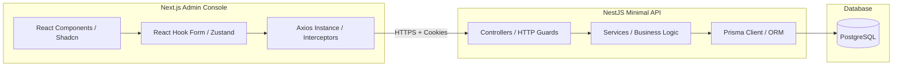
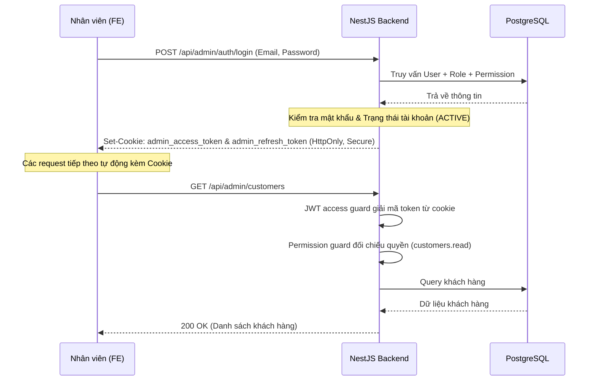

# Thiết kế kiến trúc hệ thống (System Design)

> Tài liệu mô tả kiến trúc tổng thể, mô hình giao tiếp giữa Frontend (Next.js) và Backend (NestJS), cùng cơ chế bảo mật và phân quyền hệ thống.

---

## 1. Sơ đồ kiến trúc tổng quan

Hệ thống Rental Admin được xây dựng theo kiến trúc Client-Server tách biệt:



- **Frontend**: Ứng dụng Next.js (App Router) chạy ở phía Client, chịu trách nhiệm render giao diện và quản lý state cục bộ.
- **Backend**: Rest API NestJS chạy ở phía Server, cung cấp các endpoint bảo mật, xử lý logic nghiệp vụ và giao tiếp database.
- **Database**: PostgreSQL lưu trữ dữ liệu có cấu trúc.

---

## 2. Mô hình giao tiếp & Xác thực (Authentication Flow)

Hệ thống sử dụng cơ chế xác thực **Cookie-based Stateless JWT**:



### Cơ chế lưu trữ Token bảo mật:
- **`admin_access_token`**: Lưu trong cookie với thuộc tính `HttpOnly`, `Secure`, và `SameSite=Lax`. Token này có thời hạn ngắn (ví dụ: 15 phút), dùng để xác thực các request API thông thường.
- **`admin_refresh_token`**: Lưu trong cookie `HttpOnly` với thời hạn dài hơn (ví dụ: 7 ngày), dùng để yêu cầu cấp lại access token mới khi access token cũ hết hạn (qua endpoint `POST /auth/refresh`).

---

## 3. Cơ chế Phân quyền (Role-Based Access Control - RBAC)

Quyền hạn của người dùng được tải động từ database tại mỗi request được bảo vệ (sau khi qua JWT guard):

```text
User ── (UserRole) ── Role ── (RolePermission) ── Permission
```

1. **Prisma Schema**:
   - `User`: Tài khoản nhân sự.
   - `Role`: Vai trò (ví dụ: `ADMIN`, `MANAGER`, `STAFF`, `VIEWER`).
   - `Permission`: Quyền cụ thể (ví dụ: `orders.create`, `products.update`).
   - Các bảng liên kết n-n: `UserRole` và `RolePermission`.

2. **Cách thức hoạt động ở Backend**:
   - Class `JwtStrategy` giải mã token, đọc `userId` từ payload, sau đó truy vấn PostgreSQL để lấy danh sách toàn bộ code của permissions mà user được hưởng qua các role.
   - Attach thông tin user và danh sách permissions vào object `request.user`.
   - `PermissionGuard` kiểm tra xem endpoint đích có yêu cầu quyền cụ thể nào không (qua Decorator `@RequirePermissions(PermissionCode.ProductsCreate)`). Nếu có, guard đối chiếu danh sách quyền của `request.user` để cho phép qua hoặc từ chối (`403 Forbidden`).
