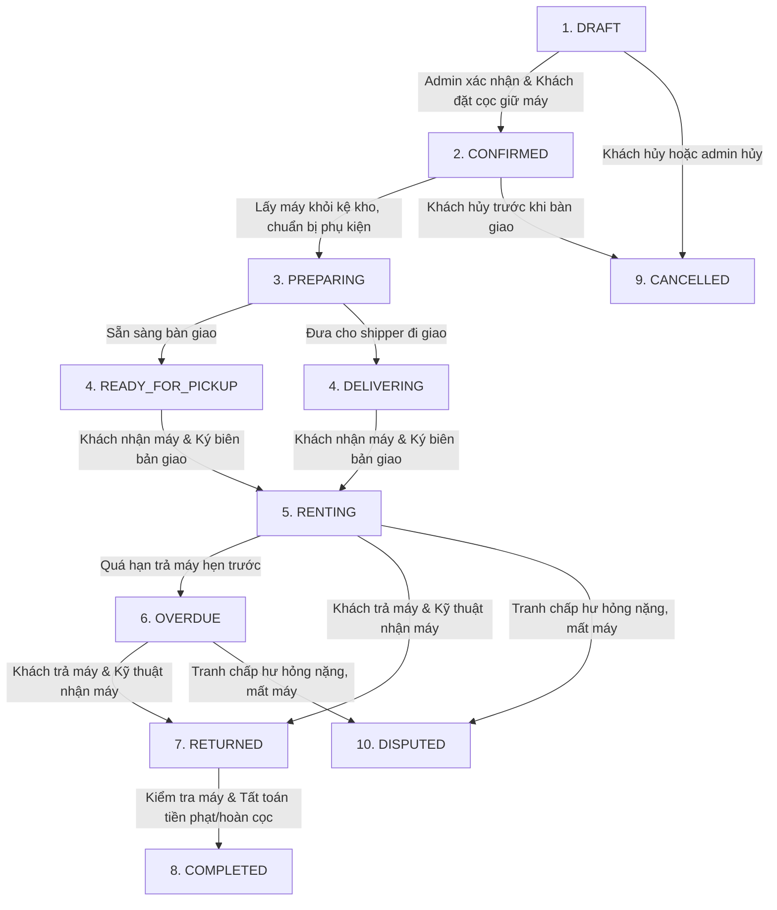

# Vòng đời đơn thuê & Luật chuyển trạng thái (OrderStatus Flow)

> Tài liệu mô tả chi tiết 10 trạng thái vận hành của `RentalOrder`, các điều kiện chuyển trạng thái, cùng ảnh hưởng tương ứng lên trạng thái thanh toán và thiết bị vật lý (`AssetUnit`).

---

## 1. Lưu đồ chuyển trạng thái chính

Quy trình chuẩn cho một đơn thuê thành công:

---

## 2. Chi tiết 10 Trạng thái vận hành (`OrderStatus`)

| # | Trạng thái | Mô tả chi tiết nghiệp vụ | Điều kiện chuyển tiếp |
|---|---|---|---|
| 1 | **`DRAFT` (Nháp)** | Đơn mới tạo bởi nhân viên. Đang chọn sản phẩm, thời gian thuê, thông tin khách. Thiết bị vật lý gán vào đơn lúc này **chưa bị khóa lịch** (vẫn khả dụng cho đơn khác). | Tạo đơn hàng mới mặc định là `DRAFT`. |
| 2 | **`CONFIRMED` (Đã xác nhận)** | Khách hàng đã cọc tiền giữ máy (`BookingHoldTotal`) hoặc được admin xác nhận giữ máy. Thiết bị vật lý gán vào dòng đơn **chính thức bị khóa lịch** trong khoảng thời gian từ `startDate` đến `blockedEndDate`. | Chuyển từ `DRAFT` khi khách cọc thành công hoặc admin xác nhận. |
| 3 | **`PREPARING` (Đang chuẩn bị)** | Nhân viên kho tiến hành gom thiết bị, sạc pin, đóng gói phụ kiện vào túi/hộp chống sốc. | Chuyển từ `CONFIRMED` khi thủ kho bắt đầu chuẩn bị máy. |
| 4 | **`READY_FOR_PICKUP` / `DELIVERING` (Sẵn sàng giao)** | Máy đã đóng gói xong. Đang chờ khách đến quầy nhận hoặc đang bàn giao cho đơn vị vận chuyển đi giao. | Chuyển từ `PREPARING` sau khi đã checklist đầy đủ phụ kiện. |
| 5 | **`RENTING` (Đang thuê)** | Khách đã nhận thiết bị vật lý và ký vào biên bản bàn giao (`OrderHandover` loại `OUTGOING`). Khách đã thanh toán đủ tiền thu trước (`UpfrontTotal`). | Chuyển từ `READY_FOR_PICKUP` / `DELIVERING` sau khi ký bàn giao. |
| 6 | **`OVERDUE` (Quá hạn)** | Đơn thuê đã vượt quá thời gian trả máy hẹn trước (`endDate`) mà khách chưa mang trả máy. | Hệ thống tự chuyển trạng thái (cron job quét) hoặc admin chuyển thủ công khi phát hiện trễ hẹn. |
| 7 | **`RETURNED` (Đã trả máy)** | Khách đã mang máy đến trả tại quầy hoặc gửi ship trả về cửa hàng. Thiết bị được gán biên bản nhận trả (`OrderHandover` loại `RETURN`). Nhân viên kỹ thuật bắt đầu làm biên bản kiểm tra (`ReturnInspection`). | Chuyển từ `RENTING` / `OVERDUE` khi máy được hoàn trả về cửa hàng. |
| 8 | **`COMPLETED` (Hoàn tất)** | Biên bản kiểm tra được chốt. Đã tính toán xong các chi phí phát sinh (tiền trễ, tiền hỏng máy nếu có), thu thêm tiền hoặc hoàn trả tiền cọc (`RefundTotal`) cho khách. Đơn thuê chính thức đóng lại. | Chuyển từ `RETURNED` sau khi tất toán toàn bộ công nợ. |
| 9 | **`CANCELLED` (Đã hủy)** | Đơn thuê bị hủy trước khi bàn giao thiết bị. Tiền đặt cọc giữ máy có thể được hoàn lại một phần hoặc giữ lại tùy theo chính sách hủy đơn. | Chỉ được hủy khi đơn ở trạng thái `DRAFT` hoặc `CONFIRMED`. |
| 10 | **`DISPUTED` (Tranh chấp)** | Thiết bị bị mất, hư hỏng nặng hoặc khách hàng từ chối đền bù. Đơn hàng chuyển sang trạng thái tranh chấp để quản lý xử lý đặc biệt. | Chuyển từ `RENTING`, `OVERDUE` hoặc `RETURNED` khi có bất đồng đền bù. |

---

## 3. Quy luật đồng bộ trạng thái tài chính & thiết bị

Khi trạng thái đơn thuê (`OrderStatus`) thay đổi, hệ thống bắt buộc phải tự động cập nhật trạng thái của thiết bị vật lý (`AssetUnit`) tương ứng:

1. **Khóa lịch (Block Schedule)**:
   - Chỉ khi đơn ở trạng thái `CONFIRMED`, `PREPARING`, `READY_FOR_PICKUP`, `DELIVERING`, `RENTING`, `OVERDUE` thì lịch thuê của thiết bị con gán trong đơn mới bị coi là **bận** (Blocked).
   - Đơn ở trạng thái `DRAFT`, `CANCELLED` hoặc `COMPLETED` sẽ giải phóng lịch của thiết bị.

2. **Cập nhật trạng thái máy (`AssetStatus`)**:
   - Khi đơn chuyển sang `RENTING`, trạng thái của `AssetUnit` phải tự động chuyển thành `RENTED`.
   - Khi đơn chuyển sang `RETURNED` và biên bản kiểm tra `ReturnInspection` ghi nhận máy ở tình trạng tốt, trạng thái của `AssetUnit` tự động chuyển về `AVAILABLE` (Sẵn sàng cho thuê tiếp).
   - Nếu biên bản kiểm tra ghi nhận máy bị hỏng, trạng thái của `AssetUnit` chuyển thành `DAMAGED` hoặc `MAINTENANCE` (không cho phép gán vào đơn thuê mới).
